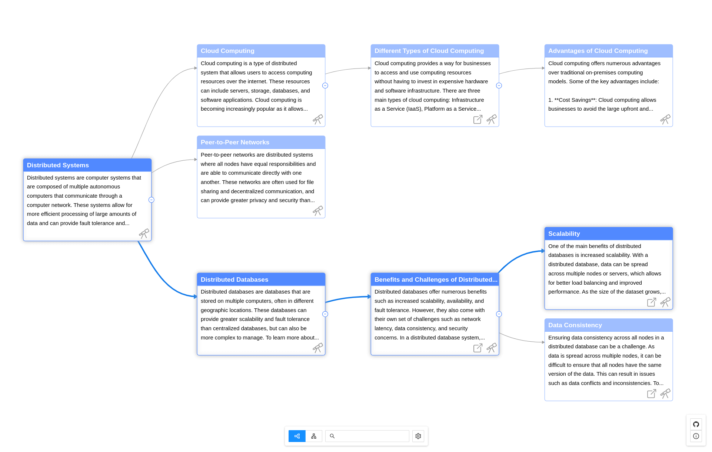

  

# GPT Graph

**GPT Graph** is a simple tool that serves as a knowledge graph explorer utilizing the GPT 3.5 turbo model to help users explore information in an organized and intuitive way.

  

## Features
- Describe specific query and generate a graph of related topics
- Auto-generated prompts for generated nodes to discover more about the topic 
- Custom prompts to ask questions and get answers, also with generated prompts to branch from your own ideas
- Markdown formatted descriptions

## Usage
- `npm install`
- `npm run dev`

## Model Parameters
- `temprature` We use the `0.7` to get different and more creative responses every time, you may play around with different values and check the output  

### API Key
OpenAI API key is required to run this tool
- You can add key through UI
- Create `.env` file in root directory, and your key as a value to `VITE_OPENAI_KEY` variable 

### Note
This tool is made just for demonstration purpose of the idea and for how to use LLMs in general, it has very limited functionalities and not tested

#### License
MIT
